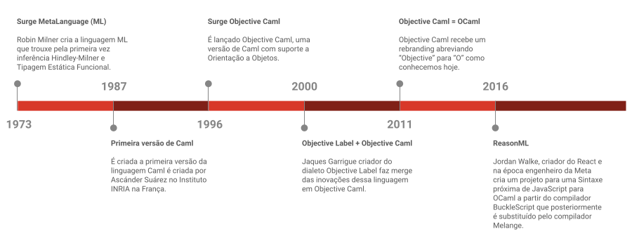

# Capítulo 1 - Introdução

## Índice
- [O que é OCaml?](#o-que-%C3%A9-ocaml)
- [História do OCaml](#hist%C3%B3ria-do-ocaml)
- [Instalação](#instala%C3%A7%C3%A3o)
- [Instalando o Dune](#instalando-o-dune)
- [Hello World](#hello-world)
- [Porque OCaml?](#porque-ocaml)
	- [Concisa e Declarativa](#concisa-e-declarativa)
  	- [Linguagens Concisas vs Verbosas](#linguagens-concisas-vs-verbosas)
	- [Redução de Erros Acidentais](#redução-de-erros-acidentais)
- [Particularidades de OCaml](#particularidades-de-ocaml)
	- [Inferência de Tipos](#infer%C3%AAncia-de-tipos)
	- [Imutabilidade](#imutabilidade)
	- [Dados e Operações](#dados-e-opera%C3%A7%C3%B5es)
- [Materiais em Inglês para aprender OCaml](#materiais-em-ingl%C3%AAs-para-aprender-ocaml)

## O que é OCaml?

[OCaml](https://OCaml.org/) é uma linguagem de programação que permite ao programador usar diferentes paradigmas, dependendo do problema que ele quer resolver. Ela tem suporte de primeira classe para o paradigma funcional, que é baseado em funções puras, imutabilidade e recursão. Ela também permite o uso do paradigma imperativo, que é baseado em variáveis, atribuições e laços. Além disso, ela oferece o paradigma orientado a objetos, que é baseado em classes, objetos e herança. Essa flexibilidade faz com que OCaml seja uma linguagem muito expressiva e versátil.

OCaml também se destaca pelo seu sistema de tipos, que é estático e inferido. Isso significa que o compilador verifica os tipos das expressões em tempo de compilação, evitando muitos erros comuns em tempo de execução. Além disso, o programador não precisa declarar explicitamente os tipos das variáveis ou dos parâmetros das funções, pois o compilador é capaz de inferi-los automaticamente. Isso torna o código mais conciso e legível.

Outra característica importante de OCaml é a sua opção de compilação. A linguagem permite que o programador escolha entre dois tipos de compilação: para bytecode ou para código nativo. A compilação para bytecode gera um código intermediário que é executado por uma máquina virtual chamada zinc. Essa opção tem a vantagem de ser mais rápida e portátil, pois o bytecode pode ser executado em qualquer plataforma que tenha a máquina virtual instalada. A compilação para código nativo gera um código específico para a arquitetura do processador do computador onde o programa será executado. Essa opção tem a vantagem de gerar um código mais eficiente e otimizado, pois aproveita as características da plataforma alvo.

Por fim, OCaml tem algumas vantagens sobre outras linguagens de programação, especialmente as funcionais. Uma delas é o seu desempenho em tempo de execução, que é comparável ao de linguagens como C ou C++. Isso se deve ao fato de que o compilador de OCaml gera código nativo com diversas otimizações, como eliminação de caixas (boxing), alocação no registro (register allocation) e análise de escape (escape analysis). Outra vantagem é a sua biblioteca padrão, que é muito bem construída e extensível. Ela oferece diversos módulos para lidar com estruturas de dados, algoritmos, entrada e saída, sistemas operacionais, redes, interfaces gráficas, entre outros. Além disso, OCaml tem uma comunidade ativa e diversificada, que contribui com vários projetos e ferramentas para a linguagem. OCaml é uma linguagem que combina eficiência, expressividade e praticidade de uma forma única.

## História do OCaml

[OCaml](https://pt.m.wikipedia.org/wiki/OCaml) é uma linguagem de programação que nasceu em 1996, fruto da união entre a linguagem funcional [Caml](https://caml.inria.fr/) e o paradigma de [orientação a objetos](https://pt.m.wikipedia.org/wiki/Orienta%C3%A7%C3%A3o_a_objetos). Caml, por sua vez, era uma linguagem derivada de [ML](https://pt.m.wikipedia.org/wiki/ML_(linguagem_de_programa%C3%A7%C3%A3o)), que foi criada na década de 1970 para ser a meta-linguagem de um provador de teoremas. OCaml é uma linguagem multiparadigma, que combina os estilos funcional, imperativo e orientado a objetos, com um sistema de tipos forte e estático, mas com inferência de tipos. OCaml também tem um sistema de módulos parametrizáveis, uma biblioteca padrão extensa e um coletor de lixo automático. OCaml se destaca por sua eficiência e confiabilidade, sendo usada tanto no meio acadêmico quanto no industrial.

A história de OCaml começa com a história de ML, que significa *Meta Language*. ML foi criada na década de 1970 por [Robin Milner](https://en.wikipedia.org/wiki/Robin_Milner) na Universidade de Edimburgo, na Escócia. ML era a linguagem usada para expressar as propriedades lógicas e as provas do sistema LCF (Logic for Computable Functions), que era um provador de teoremas interativo. ML era uma linguagem funcional, ou seja, baseada no conceito matemático de função, que recebe argumentos e retorna valores. ML também era fortemente e estaticamente tipada, ou seja, cada valor e cada função tinha um tipo definido e verificado pelo compilador. ML também tinha inferência de tipos, ou seja, o compilador conseguia deduzir os tipos das variáveis e das funções sem que o programador precisasse declará-los explicitamente.

ML logo chamou a atenção dos primeiros usuários do LCF, que perceberam que ela era uma linguagem poderosa e expressiva para programar outras coisas além de provar teoremas. Assim, ML se tornou uma linguagem geral, com suporte a estruturas de dados como listas, tuplas e registros, e controle de fluxo como condicionais e recursão. ML também tinha um sistema de módulos simples, que permitia organizar o código em unidades separadas.

Em 1984, um grupo de pesquisadores do [INRIA](https://www.inria.fr/en) (Instituto Nacional de Pesquisa em Informática e Automação) na França desenvolveu a primeira versão da linguagem Caml, que significa Categorical Abstract Machine Language. Caml era baseada em ML, mas com algumas diferenças na sintaxe e na semântica. Caml também introduziu uma máquina virtual chamada CAM (Categorical Abstract Machine), que era capaz de executar funções definidas na linguagem. A máquina CAM era baseada em um modelo matemático chamado máquina abstrata categórica, que usava conceitos da teoria das categorias para representar funções e tipos.

Caml passou por várias revisões e melhorias ao longo dos anos, até que em 1996 surgiu a versão chamada Objective Caml, ou OCaml. OCaml adicionou à linguagem Caml o suporte ao paradigma orientado a objetos, permitindo que os programadores definissem classes, objetos e métodos. OCaml também mudou a máquina virtual para uma mais eficiente, chamada ZINC (ZINC Is Not CAML), que foi escrita por [Xavier Leroy](https://xavierleroy.org/). Além disso, OCaml oferece a possibilidade de compilar o código para código nativo, para diversas plataformas, aumentando o desempenho da execução.

OCaml foi desenvolvida por [Didier Rémy](http://pauillac.inria.fr/~remy/) e [Jérôme Vouillon](https://www.irif.fr/~vouillon/), do INRIA, com a colaboração de outros pesquisadores, como [Gérard Huet](http://pauillac.inria.fr/~huet/) e [Jacques Garrigue](https://scholar.google.com/citations?user=erlIoewAAAAJ). O nome OCaml vem de Objective Caml, que significa Caml com Objetos. A introdução de objetos em OCaml possibilitou muitos avanços na pesquisa de sistemas de objetos em linguagens funcionais estaticamente tipadas e com inferência de tipos. Também permitiu melhor interoperabilidade com linguagens OOP como C++ e Java e trouxe novas funcionalidades e mudanças de sintaxe em relação a Caml.

No ano 2000, OCaml recebeu muitas atualizações com novas funcionalidades vindas dos estudos do cientista da computação Jacques Garrigue em seu dialeto de OCaml, Objective Label. Entre elas estão os argumentos opcionais, as variantes polimórficas, as anotações de variância e os métodos polimórficos. Essas funcionalidades aumentaram o poder expressivo e a flexibilidade da linguagem, permitindo que os programadores usassem tipos mais complexos e abstratos.

Desde o início dos anos 2000, OCaml tem atraído popularidade e crescido no número de universidades que adotam a linguagem para lecionar em diversas matérias, entre elas Harvard, Princeton, Brown, Columbia, Cornell, Universidade da Califórnia, Universidade de Illinois, UPenn, Universidade da Beira Interior (Portugal), Universidade de Rennes (França) e Universidade Paris-Diderot (França).

Outro ponto importante para OCaml aconteceu em 2016, quando [Jordan Walke](https://github.com/jordwalke), criador da biblioteca React e na época engenheiro na Meta criou a extensão de sintaxe [ReasonML](https://reasonml.github.io/) para OCaml. ReasonML permite escrever OCaml com uma sintaxe muito próxima do que normalmente os programadores JavaScript (e de supersets como TypeScript) encontram e transpilar essa sintaxe para OCaml onde pode ser usada para gerar binários nativos ou transpilar para JavaScript utilizando o transpilador BuckleScript e, sendo assim, pode ser usada para construir aplicações front-end, além de interagir com o ecossistema JS. Em 2020 o time de desenvolvimento do BuckleScript decidiu criar a linguagem [ReScript](https://rescript-lang.org/) e o projeto BuckleScript recebeu um fork chamado [Melange](https://melange.re/), feito por [Antonio Monteiro](https://github.com/anmonteiro), que é a forma atual de realizar a transpilação.

OCaml é uma linguagem de programação que tem uma longa história e uma grande relevância no cenário das linguagens funcionais. Ela é uma linguagem que combina vários paradigmas e funcionalidades, oferecendo aos programadores uma forma elegante, eficiente e confiável de expressar seus algoritmos e resolver seus problemas. OCaml é uma linguagem que tem uma longa história de produção e vale a pena conhecer e aprender.

<h3 align="center">

</h3>

## Instalação

Certo, agora você sabe o que é OCaml, então agora vamos para a instalação da linguagem e suas ferramentas básicas para que possamos compilar e executar nossos programas.

<strong>🐧 Linux Ubuntu:</strong>
<details>
	
1. **Instale o OPAM**: OPAM é o gerenciador de pacotes oficial do OCaml, que permite alternar facilmente entre as versões do OCaml e muito mais. Por exemplo, o OPAM torna prático lidar com diferentes projetos que requerem diferentes versões do OCaml. Para instalar o OPAM no Ubuntu, abra um terminal e execute os seguintes comandos:
```sh
$ sudo apt-get update
$ sudo apt-get install -y opam
```

2. **Instale o OCaml**: Depois de instalar o OPAM, você pode usar o opam para instalar a versão mais recente do OCaml. Para fazer isso, execute os seguintes comandos:
```sh
# entre a instalação após opam init aparecerá as opções [y/n] digite y e dê enter
$ opam init 
$ eval $(opam env)
$ opam switch create 4.14.1
$ eval $(opam env)
```
Isso criará um novo switch chamado `4.14.1` e instalará a versão 4.14.1 do OCaml nesse switch.

3. **Instale o rlwrap**: O rlwrap é uma ferramenta útil que permite usar as teclas de seta para percorrer o histórico de comandos no REPL do OCaml (Read-Eval-Print Loop). Para instalar o rlwrap no Ubuntu, execute os seguintes comandos:
```sh
$ sudo apt-get install -y rlwrap
```

4. **Adicione um alias para usar o rlwrap com o comando 'ocaml'**: Para usar o rlwrap com o comando `ocaml`, você pode adicionar um alias ao seu arquivo `.bashrc`. Abra o arquivo `.bashrc` em seu editor de texto favorito e adicione a seguinte linha ao final do arquivo:
```sh
alias ocaml='rlwrap ocaml'
```
Depois de salvar e fechar o arquivo, execute `$ source ~/.bashrc` para aplicar as alterações.

</details>

<strong>🍎 MacOS:</strong>
<details>

1. **Instale o Homebrew**: Homebrew é um gerenciador de pacotes para macOS que facilita a instalação de software. Se você ainda não tem o Homebrew instalado, pode instalá-lo abrindo um terminal e executando o seguinte comando:
```sh
$ /bin/bash -c "$(curl -fsSL https://raw.githubusercontent.com/Homebrew/install/HEAD/install.sh)"
```

2. **Instale o OPAM**: OPAM é o gerenciador de pacotes oficial do OCaml, que permite alternar facilmente entre as versões do OCaml e muito mais. Por exemplo, o OPAM torna prático lidar com diferentes projetos que requerem diferentes versões do OCaml. Para instalar o OPAM no macOS, execute os seguintes comandos:
```sh
$ brew update
$ brew install opam
```

3. **Instale o OCaml**: Depois de instalar o OPAM, você pode usar o opam para instalar a versão mais recente do OCaml. Para fazer isso, execute os seguintes comandos:
```sh
# entre a instalação após opam init aparecerá as opções [y/n] digite y e dê enter
$ opam init
$ eval $(opam env)
$ opam switch create 4.14.1
$ eval $(opam env)
```
Isso criará um novo switch chamado `4.14.1` e instalará a versão 4.14.1 do OCaml nesse switch.

4. **Instale o rlwrap**: O rlwrap é uma ferramenta útil que permite usar as teclas de seta para percorrer o histórico de comandos no REPL do OCaml (Read-Eval-Print Loop). Para instalar o rlwrap no macOS, execute os seguintes comandos:
```sh
$ brew install rlwrap
```

5. **Adicione um alias para usar o rlwrap com o comando 'ocaml'**: Para usar o rlwrap com o comando `ocaml`, você pode adicionar um alias ao seu arquivo `.bashrc` ou `.zshrc`, dependendo do shell que estiver usando. Abra o arquivo apropriado em seu editor de texto favorito e adicione a seguinte linha ao final do arquivo:
```sh
alias ocaml='rlwrap ocaml'
```
Depois de salvar e fechar o arquivo, execute `$ source ~/.bashrc` ou `$ source ~/.zshrc` para aplicar as alterações.

</details>


<strong>🪟 Windows:</strong>
<details>

1. **Instale o WSL2**: O WSL2 (Windows Subsystem for Linux 2) permite executar uma distribuição Linux diretamente no Windows. Se você ainda não tem o WSL2 instalado, pode seguir as [instruções de instalação](https://learn.microsoft.com/pt-br/windows/wsl/install) fornecidas pela Microsoft. Aqui estão os passos básicos para instalar o WSL2:
    * Abra o PowerShell ou o Prompt de Comando do Windows no modo de administrador clicando com o botão direito do mouse e selecionando "Executar como administrador".
    * Insira o comando `wsl --install` e reinicie o computador.
    * Esse comando habilitará os recursos necessários para executar o WSL e instalará a distribuição Ubuntu do Linux.

2. **Instale o Ubuntu no WSL2**: Depois de instalar o WSL2, você pode instalar a distribuição Linux Ubuntu no WSL2. Para fazer isso, abra a Microsoft Store, pesquise por "Ubuntu" e clique em "Obter" para instalar a versão mais recente do Ubuntu.

3. **Instale o OPAM**: OPAM é o gerenciador de pacotes oficial do OCaml, que permite alternar facilmente entre as versões do OCaml e muito mais. Por exemplo, o opam torna prático lidar com diferentes projetos que requerem diferentes versões do OCaml. Para instalar o OPAM no Ubuntu do WSL2, abra um terminal com Ubuntu e execute os seguintes comandos:
```sh
$ sudo apt-get update
$ sudo apt-get install -y opam
```

4. **Instale o OCaml**: Depois de instalar o OPAM, você pode usar o opam para instalar a versão mais recente do OCaml. Para fazer isso, execute os seguintes comandos no Ubuntu do WSL2:
```sh
# entre a instalação após opam init aparecerá as opções [y/n] digite y e dê enter
$ opam init
$ eval $(opam env)
$ opam switch create 4.14.1
$ eval $(opam env)
```
Isso criará um novo switch chamado `4.14.1` e instalará a versão 4.14.1 do OCaml nesse switch.

5. **Instale o rlwrap**: O rlwrap é uma ferramenta útil que permite usar as teclas de seta para percorrer o histórico de comandos no REPL do OCaml (Read-Eval-Print Loop). Para instalar o rlwrap no Ubuntu, execute os seguintes comandos:
```sh
$ sudo apt-get install -y rlwrap
```

6. **Adicione um alias para usar o rlwrap com o comando 'ocaml'**: Para usar o rlwrap com o comando `ocaml`, você pode adicionar um alias ao seu arquivo `.bashrc`. Abra o arquivo `.bashrc` em seu editor de texto favorito e adicione a seguinte linha ao final do arquivo:
```sh
alias ocaml='rlwrap ocaml'
```
Depois de salvar e fechar o arquivo, execute `$ source ~/.bashrc` para aplicar as alterações.

</details>

> Em 16 de dezembro de 2022 foi lançado a versão 5.0.0 de OCaml que trouxe muitas mudanças na linguagem e runtime. Porém, para simplicidade e focar no core da linguagem esse tutorial 4Noobs vai no momento usar a versão 4.14.1. Há planos de trazer uma atualização para as novidades da versão 5.0.0 mais à frente.

## Instalando o Dune

A seguir, vamos instalar a ferramenta **Dune**, um sistema de `build system` para projetos em OCaml/Reason. Ela se encarrega dos detalhes de baixo nível da compilação de OCaml, bastando que configuremos o projeto corretamente. Assim, ela cuidará do resto para nós.

- Em seguida, instalaremos o Dune com o OPAM, que já instalamos anteriormente.
```sh
$ opam install dune
```

E agora, vamos para nosso primeiro exemplo.

## Hello World

#### Maldição do Programador

Existe uma maldição que afeta os programadores que se aventuram em aprender novas linguagens de programação. Segundo a [lenda da maldição do programador](https://www.urbandictionary.com/define.php?term=The%20Programmer%27s%20Curse), o primeiro programa que você escreve em uma nova linguagem deve ser o que exibe a mensagem "Hello World" na tela, ou você terá um grande azar e sofrerá com muitos erros e bugs. Essa maldição é tão antiga quanto a própria programação, e tem origem no primeiro programa de demonstração criado por Brian Kernighan em 1972. Desde então, muitos programadores seguem essa tradição como uma forma de se familiarizar com a sintaxe e a estrutura de uma nova linguagem, e também de se proteger da maldição. Por isso, vamos começar pelo básico e aprender como implementar esse programa simples e poderoso.

Para isso vamos precisar:
- De um editor de texto minimamente decente (nada de Notepad no Windows);
- Um terminal com OCaml instalado.

#### Primeiro programa OCaml

Para começar o nosso projeto, vamos usar o comando `dune init` com o argumento `proj`, que indica o nome do projeto que queremos criar. Neste caso, vamos chamar o nosso projeto de `helloworld`:
> Antes de executar o comando, certifique-se de estar na pasta onde deseja salvar o seu projeto.
```sh
$ dune init proj helloworld
``` 

Depois de inicializar o projeto, vamos entrar na pasta `helloworld` que foi criada pelo comando anterior:
```sh
$ cd helloworld
```

Dentro dessa pasta, vamos encontrar os seguintes arquivos e subpastas (a estrutura de arquivos está mostrada abaixo):
```
.
├── _build
│   └── log
├── bin
│   ├── dune
│   └── main.ml
├── dune-project
├── helloworld.opam
├── lib
│   └── dune
└── test
    ├── dune
    └── helloworld.ml
```
E que respectivamente são:
- **_build**: Esta é a pasta onde o OCaml guarda os arquivos gerados pela compilação do seu projeto. Você não precisa se preocupar com o que tem dentro dela, pois o OCaml cuida de tudo para você.
  - **log**: Este é um arquivo que registra as ações realizadas pelo OCaml durante a compilação. Ele pode ser útil para depurar possíveis erros ou avisos que ocorram no processo.
- **bin**: Esta é a pasta onde você vai colocar os arquivos que definem os executáveis do seu projeto. Um executável é um programa que pode ser rodado diretamente pelo sistema operacional, sem precisar de um interpretador ou compilador.
  - **dune**: Este é um arquivo que especifica as configurações e dependências do seu executável. O dune é um sistema de construção (build system) para OCaml, que facilita a compilação e execução dos seus projetos.
  - **main.ml**: Este é o arquivo principal do seu executável, onde você vai escrever o código OCaml que define o comportamento do seu programa. Você pode usar outros arquivos e módulos para organizar melhor o seu código, mas este é o ponto de entrada do seu executável.
- **dune-project**: Este é um arquivo que identifica o seu projeto como um projeto dune. Ele contém informações gerais sobre o seu projeto, como o nome, a versão, os autores, as licenças, etc.
- **helloworld.opam**: Este é um arquivo que descreve o seu projeto como um pacote opam. O opam é um gerenciador de pacotes para OCaml, que permite instalar e usar bibliotecas de terceiros no seu projeto. Este arquivo contém informações sobre as dependências, os arquivos e os comandos do seu pacote.
- **lib**: Esta é a pasta onde você vai colocar os arquivos que definem as bibliotecas do seu projeto. Uma biblioteca é um conjunto de módulos e funções que podem ser reutilizados em outros projetos ou executáveis.
  - **dune**: Este é um arquivo que especifica as configurações e dependências da sua biblioteca. Ele segue o mesmo formato do arquivo dune da pasta bin.
- **test**: Esta é a pasta onde você vai colocar os arquivos que definem os testes do seu projeto. Os testes são programas que verificam se o seu código funciona corretamente, comparando os resultados esperados com os resultados obtidos.
  - **dune**: Este é um arquivo que especifica as configurações e dependências dos seus testes. Ele segue o mesmo formato do arquivo dune da pasta bin.
  - **helloworld.ml**: Este é um arquivo que contém os testes do seu projeto. Você pode usar uma biblioteca de testes como o Alcotest ou OUnit para escrever e executar os seus testes.

O arquivo `bin/main.ml` contém o código que define o nosso executável. Se você abrir esse arquivo, vai ver que ele já tem uma linha de código escrita para nós pelo comando `dune init`:
```OCaml
let () = print_endline "Hello, World!"
```

Essa linha de código é uma função anônima que imprime na tela a mensagem "Hello, World!". Essa é a forma mais simples de escrever um programa em OCaml.

Para compilar o nosso código, vamos usar o comando `dune build`. Esse comando vai gerar os arquivos necessários para executar o nosso programa na pasta `_build`:
```terminal
$ dune build
```

Para rodar o nosso programa, vamos usar o comando `dune exec` com o nome do nosso projeto. Como o nosso projeto se chama `helloworld`, o comando fica assim:

```terminal
$ dune exec helloworld
```

Esse comando vai procurar pelo executável do nosso projeto na pasta `_build` e executá-lo. Você não precisa se preocupar com o caminho completo do executável, pois o dune sabe onde encontrá-lo.

Quando você rodar esse comando, você vai ver a mensagem “Hello, World!” na tela. Isso significa que o seu programa funcionou corretamente. 

Parabéns, você acabou de criar e rodar o seu primeiro programa em OCaml!

#### Indo um pouco mais além!

Escrevemos nosso primeiro código em OCaml, que imprime "Hello, World!" na tela. Agora, vamos modificar nosso código para usar uma função mais avançada de impressão, que nos permite formatar o texto com marcadores.

Abra o arquivo `bin/main.ml` no seu editor de texto favorito e substitua o conteúdo por este:
```OCaml
let () = Printf.printf "Hello, %s!" "World"
```
Salve o arquivo e volte para o terminal. Vamos recompilar nosso projeto usando o comando:

```sh
$ dune build
```

Você deve notar que a compilação foi mais rápida do que da primeira vez, mesmo sendo um projeto pequeno. Isso acontece porque o compilador de OCaml é inteligente o suficiente para compilar apenas o que é necessário.

Agora, vamos executar nosso projeto usando o comando:
```sh
$ dune exec ./helloworld.exe
```

Você deve ver na tela a mensagem "Hello, World!". Mas o que mudou no nosso código? Bem, nós usamos a função `Printf.printf` em vez da função `print_endline`. A função `Printf.printf` é uma função que permite imprimir texto formatado usando marcadores. Os marcadores são símbolos que indicam o tipo e a posição dos dados que serão inseridos na string. Por exemplo, o marcador `%s` indica que uma string será inserida na posição correspondente. No nosso caso, nós usamos o marcador `%s` e passamos a string `"World"` como argumento. Assim, a função `Printf.printf` substitui o marcador pela string e imprime "Hello, World!".

Mas o que acontece se nós tentarmos passar um valor de outro tipo, como um número ou um booleano? Vamos tentar alterar nosso código para isso:

```OCaml
let () = Printf.printf "Hello, %s!" 42
```

Salve o arquivo e tente recompilar o projeto. Você deve ver um erro parecido com este:

```
1 | let () = Printf.printf "Hello, %s!" 42
                                        ^^
Error: This expression has type int but an expression was expected of type
         string
```

O erro diz que a expressão `42` tem o tipo `int`, mas uma expressão do tipo `string` era esperada. Isso significa que o compilador de OCaml verifica os tipos dos dados que são passados para a função `Printf.printf` e garante que eles sejam compatíveis com os marcadores usados na string. Isso é uma das características mais legais de OCaml: a **tipagem estática**. A tipagem estática significa que os tipos dos dados são verificados em tempo de compilação, antes do programa ser executado. Isso ajuda a evitar erros de tipo em tempo de execução, que podem causar falhas ou comportamentos inesperados no programa.

OCaml usa um sistema de tipagem chamado **Hindley-Milner**, que é um sistema de tipagem muito poderoso e expressivo. Ele permite que o compilador infira os tipos dos dados sem precisar de anotações explícitas na maioria dos casos. Ele também permite definir tipos abstratos, tipos algébricos, tipos paramétricos, tipos recursivos e tipos polimórficos. Nós vamos aprender mais sobre esses tipos nos próximos tutoriais.

Por enquanto, vamos voltar ao nosso código original e usar um marcador adequado para o valor `42`. O marcador para números inteiros é `%d`. Então, vamos mudar nosso código para:

```OCaml
let () = Printf.printf "Hello, %d!" 42
```

Salve o arquivo e recompile o projeto. Agora você deve ver na tela a mensagem "Hello, 42!". 

## Porque OCaml?

### Concisa e Declarativa

OCaml é uma linguagem de programação que se destaca por sua sintaxe declarativa e concisa. Essas duas características trazem vantagens para os programadores que usam OCaml, pois permitem escrever códigos mais claros, expressivos e eficientes.

A sintaxe declarativa significa que o programador pode focar na solução do problema, sem ter que especificar todos os passos para alcançá-la. Em vez de dizer ao computador como fazer algo, o programador diz o que quer fazer. Por exemplo, para somar os elementos de uma lista, o programador pode usar a função `List.fold_left (+) 0`, que recebe uma função de soma, um valor inicial e uma lista, e retorna a soma dos elementos da lista. Essa função é declarativa porque abstrai os detalhes de como a soma é realizada, deixando apenas a intenção do que se quer fazer.

A sintaxe concisa significa que o programador pode escrever códigos mais curtos, sem perder a legibilidade ou a funcionalidade. Em OCaml, o programador pode usar recursos como inferência de tipos, funções de alta ordem, operadores de canalização e composição, e padrões de correspondência para reduzir a quantidade de código necessário para expressar uma ideia. Por exemplo, para dobrar os elementos de uma lista e somá-los, o programador pode escrever:

```FSharp
let double_sum = [6;7;8]       (* 1 *)
  |> List.map (fun x -> x * 2) (* 2 *)
  |> List.fold_left (+) 0;;    (* 3 *)
//=> val double_sum : int = 42
 ```
> Você pode testar escrevendo essa função no REPL (Read-Evaluate-Print-Loop) de OCaml, basta digitar o comando `$ ocaml` em seu terminal. Nesse exemplo o comentário `//=> ...` demonstra o que foi retornado pelo REPL.

Esse código é conciso porque:

1. Não é preciso declarar o tipo da lista ou da variável `double_sum`, pois OCaml infere automaticamente que são inteiros.
2. Não é preciso definir uma função separada para dobrar um número, pois OCaml permite usar funções anônimas (ou lambdas) como argumentos de outras funções.
3. Não é preciso usar parênteses ou vírgulas para separar os argumentos das funções, pois OCaml usa espaços em branco para isso.
4. Não é preciso usar pontos e vírgulas para terminar cada linha de código, pois OCaml usa ponto e vírgula duplo para indicar o fim de uma expressão.

A sintaxe declarativa e concisa de OCaml facilita a compreensão e a manutenção dos códigos escritos nessa linguagem, além de torná-los mais elegantes e legíveis.

### Linguagens Concisas vs Verbosas

Para ilustrar a diferença de verbosidade entre as linguagens, vamos usar nosso exemplo anterior: calcular a soma dos quadrados dos números 6, 7 e 8.  Para isso usamos duas funções de alta ordem: `List.fold_left` e `List.map` nas linhas `(* 1 *)` e `(* 2 *)`, que aplicam uma função a cada elemento de uma lista e retornam um resultado acumulado ou uma nova lista, respectivamente. A função que multiplica um número por si mesmo é definida usando uma expressão lambda: `(fun x -> x * 2)`. 

Em C#, para fazer a mesma coisa, precisaríamos escrever muito mais código usando o paradigma imperativo. Por exemplo, teríamos algo assim:

```C#
using System;
using System.Collections.Generic;

class Program {
  static void Main(string[] args) {
   List<int> input = new List<int>();
   input.Add(6);
   input.Add(7);
   input.Add(8);
   
   List<int> squared = new List<int>();
   
   for (int i = 0; i < input.Count; i++) {
    int number = input[i];
    int square = number * number;
    squared.Add(square);
   }
   
   int sum_of_squares = 0;
   
   for (int i = 0; i < squared.Count; i++) {
    int number = squared[i];
    sum_of_squares += number;
   }
   
   Console.WriteLine(sum_of_squares);
  }
}
```

Esse código usa muitas variáveis, atribuições, laços e índices para manipular as listas e obter o resultado desejado. O código é muito mais longo e menos expressivo do que o código em OCaml.

A razão para essa diferença de verbosidade é que C# usa um paradigma de programação chamado imperativo, enquanto OCaml usa um paradigma chamado declarativo. Isso significa que, em C#, nós temos que especificar cada passo que queremos executar para obter o resultado desejado, enquanto em OCaml nós apenas descrevemos o resultado que queremos obter, sem se preocupar com os detalhes de como isso é feito.

É claro que também é possível escrever código declarativo em C# ou código imperativo em OCaml, mas esse exemplo mostra como cada linguagem foi projetada para favorecer um estilo de programação diferente. OCaml nos permite escrever código mais conciso e funcional, que pode ser mais fácil de entender e manter.

### Redução de Erros Acidentais

No artigo ["No Silver Bullet" (Não existe bala de prata)](https://en.wikipedia.org/wiki/No_Silver_Bullet), Fred Brooks faz uma distinção entre a complexidade acidental e a complexidade essencial.

- A **Complexidade Acidental** é a complexidade que nos é imposta pelas ferramentas que escolhemos usar.
- A **Complexidade Essencial** é a complexidade inerente ao problema que estamos tentando resolver.

A Complexidade Acidental é um problema que pode e deve ser eliminado. Por exemplo, quanto menos tivermos que lidar com ponteiros de memória, gerenciamento de recursos de memória ou qualquer outra coisa que não esteja diretamente relacionada ao problema que estamos tentando resolver, melhor. OCaml ajuda a minimizar esse tipo de problema da Complexidade Acidental, permitindo-nos focar na Complexidade Essencial, que é o verdadeiro desafio a ser resolvido.

Aqui está um exemplo do algoritmo Quicksort em OCaml:
```Fsharp
let rec quicksort = function
    | [] -> []                                               (* 1 *)
    | x :: xs ->
              let smaller = List.filter ((>) x) xs in        (* 2 *)
              let bigger = List.filter ((<) x) xs in         (* 2 *)
                quicksort smaller @ [x] @ quicksort bigger;; (* 3 *)
//=> val quicksort : 'a list -> 'a list = <fun>
```

Observe como o algoritmo em OCaml se aproxima da definição original do algoritmo Quicksort. Claro, há uma sintaxe que pode não ser familiar para um usuário que não está acostumado com linguagens funcionais. Vamos analisar:

1. Aqui podemos ver que o Quicksort se divide em duas possibilidades, dois casos:
	- A possibilidade de receber uma lista vazia, verificada pelo [casamento de padrões (pattern match)](https://pt.wikipedia.org/wiki/Casamento_de_padr%C3%B5es). Se for uma lista vazia, o retorno também é uma lista vazia.
	- Todos os outros casos.
2. Quando a função recebe um valor, ela divide o restante dos valores em dois grupos:
	- Itens menores que x
	- Itens maiores que x
3. Então, o grupo menor é ordenado recursivamente, o maior também é ordenado recursivamente e ambos são concatenados com o item x (o primeiro item da lista ou cabeça, retirado através do padrão de correspondência em x :: xs, que seria o mesmo que cabeça :: cauda) no meio -> [menores. x. maiores]

Na primeira linha temos a palavra <u>rec</u>, uma abreviação para 'recursive' (recursivo), que informa ao compilador que essa função pode ter que chamar a si mesma. Isso é um exemplo de Complexidade Acidental que ainda se mantém em OCaml, pois não há motivo lógico ou matemático para esse comando estar ali. Logicamente e matematicamente, todas as funções devem ser capazes de chamar a si mesmas. No entanto, por razões externas ao problema que estamos resolvendo, precisamos informar ao compilador de OCaml que essa função pode ter que chamar a si mesma.

Agora vamos contrastar isso com o mesmo algoritmo em C++:
```C++
#include <iostream>

void quickSort(int * array, int low, int high) {
  int i = low;
  int j = high;
  int pivot = array[(i + j) / 2];
  int temp;

  while (i <= j) {
    while (array[i] < pivot)
      i++;
    while (array[j] > pivot)
      j--;
    if (i <= j) {
      temp = array[i];
      array[i] = array[j];
      array[j] = temp;
      i++;
      j--;
    }
  }
  if (j > low)
    quickSort(array, low, j);
  if (i < high)
    quickSort(array, i, high);
}
 ```
Podemos observar que em C++ (ou qualquer outra linguagem imperativa como Java ou C#), o código descreve o procedimento passo-a-passo e não a definição do algoritmo. Pode parecer mais claro para você se estiver mais acostumado a ler código imperativo. No entanto, pense na complexidade adicional envolvida em entender todas as instruções e passos presentes no código C++. A recompensa é poder escrever códigos mais concisos e claros usando OCaml.

## Particularidades de OCaml

### Inferência de Tipos

OCaml é uma linguagem que pertence à família ML, que se caracteriza por ter um sistema de tipos muito poderoso e sofisticado. Um dos aspectos mais interessantes desse sistema de tipos é a capacidade de inferir os tipos das expressões sem que o programador tenha que declará-los explicitamente. Isso significa que o compilador pode deduzir, a partir do contexto e das operações usadas, qual é o tipo mais adequado para cada variável, função ou dado. Isso facilita a escrita de programas, pois evita a repetição e a verbosidade de especificar os tipos manualmente.

> Inferência de tipos é a propriedade de um sistema de tipos que permite ao compilador determinar o tipo de uma expressão em uma linguagem formal, sem que o programador tenha que fornecer anotações de tipo explícitas.

O sistema de tipos usado por OCaml é baseado no sistema Hindley-Milner, que é um sistema clássico para linguagens funcionais com polimorfismo paramétrico. O polimorfismo paramétrico é a capacidade de definir funções ou tipos que podem ser aplicados a diferentes tipos de argumentos, sem perder a segurança de tipos. Por exemplo, podemos definir uma função que retorna o primeiro elemento de uma lista, sem saber qual é o tipo dos elementos da lista. Essa função pode ser usada com listas de inteiros, listas de strings, listas de listas, etc.

Para entender como a inferência de tipos funciona em OCaml, vamos ver alguns exemplos simples. Considere a seguinte função que calcula o fatorial de um número inteiro:
```FSharp
let rec fatorial n =
  if n = 0 then 1
  else n * fatorial (n - 1);;
//=> val fatorial : int -> int = <fun>
```
Em OCaml, não precisamos declarar o tipo dos argumentos e do resultado da função fatorial. A implementação faz a inferência de tipos e nos diz que o tipo da função é `int -> int`, ou seja, uma função que recebe um inteiro e retorna um inteiro. 

Como a implementação chegou a esse tipo? Ela usou o Algoritmo W, que é uma versão eficiente do algoritmo de Hindley-Milner. O Algoritmo W consiste em dois passos principais: geração de restrições e unificação. No primeiro passo, o algoritmo atribui variáveis de tipo às expressões que não têm um tipo conhecido e gera restrições entre essas variáveis e os tipos conhecidos. No segundo passo, o algoritmo tenta unificar as restrições, ou seja, encontrar uma solução que satisfaça todas elas. Se a unificação for bem-sucedida, o algoritmo retorna o tipo mais geral da expressão. Se a unificação falhar, o algoritmo reporta um erro de tipo.

No exemplo da função `fatorial`, o Algoritmo W faz o seguinte:

- Atribui uma variável de tipo `a` à expressão `n`, que é o argumento da função.
- Atribui uma variável de tipo `b` à expressão `fatorial n`, que é a chamada recursiva da função.
- Atribui uma variável de tipo `c` à expressão `n * fatorial (n - 1)`, que é o corpo da função.
- Gera as seguintes restrições:
  - `a = int`, pois `n` é comparado com `0`, que é um inteiro.
  - `b = int`, pois `n` é multiplicado por `fatorial (n - 1)`, que deve ser um inteiro.
  - `c = int`, pois o resultado da multiplicação é um inteiro.
  - `a -> c = a -> b`, pois a função `fatorial` tem o mesmo tipo do seu corpo.
- Unifica as restrições, obtendo a solução:
  - `a = int`
  - `b = int`
  - `c = int`
  - `a -> c = int -> int`
- Retorna o tipo mais geral da expressão, que é `int -> int`.

A inferência de tipos Hindley-Milner é poderosa porque permite escrever programas sem anotações de tipo, mas mantendo a segurança de tipos. Além disso, ela suporta o polimorfismo paramétrico, que permite escrever funções genéricas que podem ser aplicadas a diferentes tipos de dados. Essas características tornam a linguagem OCaml expressiva e flexível, sem perder a robustez e a eficiência.

### Imutabilidade

Quando programamos, usamos variáveis para armazenar e manipular dados. Por exemplo, podemos ter uma variável que guarda uma lista de números, como [1; 2; 3]. Mas o que acontece se quisermos mudar essa lista, por exemplo, adicionando um número a mais? Em algumas linguagens de programação, como C#, isso é possível e fácil de fazer. Podemos simplesmente usar um comando que altera a lista original, como `numbers.Add(4)`, e a variável passa a guardar a lista [1; 2; 3; 4]. Esse tipo de linguagem é chamada de imperativa, pois permite que os dados sejam modificados ou mutados ao longo do programa.

```CSharp
var numbers = new List<int>() {1, 2, 3};
numbers.Add(4);
```

Em outras linguagens de programação, como OCaml, isso não é possível nem fácil de fazer. Não podemos simplesmente mudar a lista original, pois ela é imutável. Imutável significa que os dados não podem ser alterados depois de criados e que as variáveis não podem mudar de valor depois de atribuídas. Por isso, se quisermos ter uma nova lista com um número a mais, temos que criar uma nova lista baseada na anterior, como `let moreNumbers = 4 :: numbers`, e a variável passa a guardar a lista [4; 1; 2; 3]. Mas a lista original continua sendo [1; 2; 3] e não é afetada pela operação. Esse tipo de linguagem é chamada de funcional, pois baseia-se em funções que retornam novos dados sem modificar os antigos.

```OCaml
let numbers = [3;2;1]
let moreNumbers = 4 :: numbers 
```

Você pode estar se perguntando: por que usar imutabilidade? Qual é a vantagem de não poder mudar os dados? A resposta é que a imutabilidade traz vários benefícios para o desenvolvimento de software, especialmente em situações onde vários processos ou threads podem acessar ou modificar os mesmos dados ao mesmo tempo. Com a imutabilidade, não há risco de conflitos, inconsistências ou efeitos colaterais indesejados, pois os dados são sempre consistentes e previsíveis. Além disso, a imutabilidade facilita o entendimento do código, pois não há dependência de estado ou ordem de execução. A imutabilidade também permite algumas otimizações de desempenho e memória, como o compartilhamento de estruturas de dados imutáveis entre diferentes partes do código, ou a aplicação de técnicas de memoização ou avaliação preguiçosa.

> A imutabilidade oferece muitas vantagens para o desenvolvimento de software, especialmente em cenários de concorrência e paralelismo. Ela facilita o raciocínio sobre o código, evita erros e inconsistências, e permite otimizações de desempenho e memória. Se você quer saber mais sobre esse paradigma e suas vantagens, leia o texto da April Gonçalves, [Programação Funcional Deve Ser Sua Prioridade número #1 em 2015](https://github.com/ericdouglas/traduz-ai/blob/master/javascript/008-programacao-funcional-prioridade-2015.md). 

Ok, eu vou tentar reduzir a minha explicação para 2000 caracteres. Eu também vou usar o exemplo com Point, que é mais interessante do que TwoNumbers. Veja se você gosta da minha nova versão:

### Dados e Operações

Em programação, você usa dados e operações. Dados são informações, como números, textos, imagens, etc. Operações são ações, como somar, comparar, mostrar, etc.

Em C#, os dados e as operações são juntados em objetos. Por exemplo, se você quiser representar um ponto no plano (que tem x e y), você cria uma classe Point com dois atributos (X e Y) e vários métodos (como Move e ToString).

Em OCaml, os dados e as operações são separados em tipos e funções. Por exemplo, se você quiser representar um ponto no plano (que tem x e y), você cria um tipo point com dois campos (x e y) e várias funções (como distance e print).

A separação em OCaml tem vantagens sobre a junção em C#, como:

- Simplicidade: o código em OCaml é mais curto e claro do que o código em C#, pois ele usa menos linhas e menos palavras.
- Segurança: o código em OCaml é mais seguro e confiável do que o código em C#, pois ele evita mudar os dados sem querer ou sem perceber.
- Flexibilidade: o código em OCaml é mais flexível e reutilizável do que o código em C#, pois ele permite usar operações que não estão definidas no tipo ou que são definidas em outros módulos.

Para ver essas vantagens na prática, vamos comparar alguns trechos de código em OCaml e C#. Suponha que temos uma classe Point em C#:

```C#
class Point
{
    public int X { get; set; }
    public int Y { get; set; }

    public Point(int x, int y)
    {
        X = x;
        Y = y;
    }

    public void Move(int dx, int dy)
    {
        X += dx;
        Y += dy;
    }

    public override string ToString()
    {
        return $"({X}, {Y})";
    }
}
```

Em OCaml, podemos representar um ponto como um novo tipo de dado que contém dois valores inteiros e agora ele pode ser usado em qualquer lugar que seja necessário exatamente dois valores inteiros, sem implicar em nada sobre quais números eles representam e não possuem nenhum tipo específico de operações. 

```OCaml
type point = int * int
```

Se quisermos mover um ponto em C#, podemos usar o método Move da classe:

```C#
var p1 = new Point(1, 2);
Console.WriteLine(p1); // (1, 2)
p1.Move(3, 4);
Console.WriteLine(p1); // (4, 6)
```

Em OCaml, não podemos alterar o valor de p1 diretamente, pois ele é imutável. Em vez disso, podemos ter a função move que opera sobre um dado com o formato point:

```FSharp
let move ((x, y):point) distance_x distance_y : point = (x + distance_x, y + distance_y);;
//=> val move : point -> int -> int -> point = <fun>
```

E então podemos usá-la para operar um de nossos valores e retornar um novo resultado:

```FSharp
move (1, 2) 3 4;;
//=> point = (4, 6)
```

Esse exemplo mostra como a separação entre dados e operações em OCaml permite um controle maior sobre o estado do programa e evita efeitos colaterais indesejados.

## Materiais em Inglês para aprender OCaml
- [Real World OCaml](https://dev.realworldocaml.org/toc.html)
- [Functional Programming in OCaml](https://www.cs.cornell.edu/courses/cs3110/2019sp/textbook/)
- [99 Problems](https://ocaml.org/learn/tutorials/99problems.html)
- [OCaml Manual](https://ocaml.org/manual/)
- [janestreet/learn-ocaml-workshop](https://github.com/janestreet/learn-ocaml-workshop)

#### E por enquanto, é só nos vemos no [próximo Capítulo](https://github.com/Camilotk/ocaml4noobs/blob/master/2-funcoes/README.md)! 😉

## Referências
- [Install OCaml](https://OCaml.org/docs/install.html)
- [How to install opam](https://opam.OCaml.org/doc/Install.html)
- [Dune Quickstart](https://dune.readthedocs.io/en/stable/quick-start.html)
- [Caml Language History](https://caml.inria.fr/about/history.en.html)
- [OCaml - Wikipédia](https://pt.wikipedia.org/wiki/OCaml)
