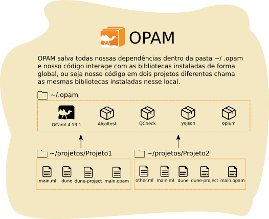
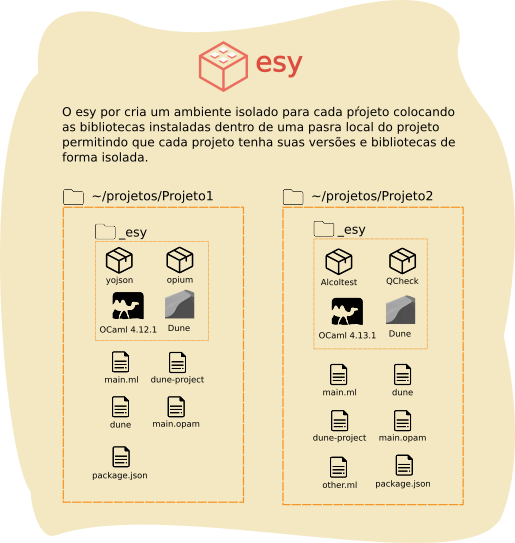

# esy
 

Uma das partes mais importantes de qualquer linguagem de programação é o **gerenciamento de dependências**, isso é o gerenciamento da instalação das extensões, bilbliotecas e libs em nossos projetos para que não tenhamos que fazer isso manualmente. Até agora temos utilizado o gerenciador de dependências OPAM que é o gerenciador de dependências mais antigo de OCaml e isso é importante porque o esy não é uma substituição ao OPAM, mas uma ferramenta contruída em cima do OPAM para nos oferecer uma melhor interface e manutenção de nossos projetos.


## Principais diferenças entre esy e OPAM

Primeiramente, a coisa mais importante que temos que entender é que o esy tem os repositórios OPAM disponíveis, isso significa que qualquer pacote que esteja disponível para OPAM vai estar disponível para o esy, isso significa que qualquer coisa que instalamos até agora pode também ser instalada com esy.

Para entender a principal diferença de funcionamento entre esy e OPAM é necessário que possamos entender como ambos os gerenciadores de dependências instalam e trabalham com as dependências de nossos projetos.

OPAM que é o gerenciador de dependências mais antigo e usado entre os dois faz a instalação de pacotes de forma global.



Enqaunto o esy faz o *sandboxing*, ou seja separa as dependências de cada projeto separadamente.



Outra característica clara que podemos notar em um projeto esy é a intencional semelhança com os gerenciadores tradicionais de pacote do JavaScript como o npm, essas semelhanças incluem:

- A declaração das dependências em um arquivo chamado **package.json**
- A criação de uma pasta **node_modules** quando o processo de instalação de pacotes é iniciado
- O isolamento de pacotes dentro de uma pasta de projetos, a pasta **node_modules** no caso do npm e a pasta **_esy** no caso do esy.

O arquivo **package.json** é o arquivo de listagem de dependências e de configuração do projeto, enquando no OPAM como vimos até agora usávamos o comando *install* para instalar os nossos pacotes com esy vamos criar um arquivo package que vai conter a definição de nossas dependências que serão instaladas.

## Devo usar esy ou OPAM?

Use o que preferir!

Até agora temos usado OPAM que é o gerenciador de dependências mais tradicional e agora vamos dar uma olhada um pouco mais em esy justamente porque ele traz bastante vantagens em relação ao OPAM principalmente quanto a performance e isolamento das dependências do projeto.

Você pode continuar usando OPAM caso queira, muitos dos maiores projetos em OCaml usam unicamente OPAM também, mas eu pessoalmente prefiro utilizar unicamente o esy nos meus projetos (e uso o OPAM apenas para instalar e gerenciar a versão global do OCaml na minha máquina para quando quero usar o REPL ou fazer coisas simples como scripts).

## Aprendendo esy

Bem tendo visto os conceitos básicos, vamos começar a ver na prática como criar um projeto com esy. Primeiramente é necessário que tenhamos a ferramenta **npm** instalada em nosso computador para que seja possível instalar o esy.

### Instalando o npm

Caso ainda não tenha você pode instalar utilizando o gerenciador de dependências da sua distribuição linux, como exemplo no Fedora: 

```bash
$ sudo dnf install npm
```

Ou se preferir você pode usar o **fnm** (fast node manager) que é um gerenciador de versões do node escrito em Rust que permite que façamos a instalação de várias versões do node/npm e façamos o gerenciamento entre elas dentro da ferramenta, para instalar o fnm use:

```bash
$ curl -fsSL https://fnm.vercel.app/install | bash
```

Após o término da instalação, você terá que fechar e abrir novamente o terminal, e você vai poder usar o comando install para instalar a última versão lts do node:

```bash
$ fnm install --lts
```

E agora os comandos **node** e **npm** vão estar disponíveis para uso, caso queira ajuda para aprender os outros comandos do fnm consulte o repositório do projeto no GitHub ou use o comando:

```bash
$ fnm --help
```

### Instalando esy

Após ter instalado o **npm** podemos utilizá-lo para instalar o esy de forma global em nossa máquina, para isso usamos o comando:

```
$ npm install -g esy
```

> Provavelmente você vai ter problemas de permissão ao executar comandos para fazer uma instalação global a primeira vez em ambiente UNIX como Linux e Mac, não recomendo que utilize privilégio de superusuário para instalar pacotes npm, ao invés disso você pode fazer [essa gambiarra](https://github.com/sindresorhus/guides/blob/main/npm-global-without-sudo.md).

### Passo a Passo

Para começar a utilizar esy vamos começar criando dentro da pasta de nosso projeto de exemplo um **package.json** vazio, apenas com chaves:
```
{}
```

A primeira coisa que vamos definir vai ser qual a versão de OCaml (e das ferramentas que vem junto na instalação como os compiladores) vamos utilizar para isso vamos adicionar **ocaml** dentro da nossa lista de dependências ou seja, dentro de **dependencies**:

```json
{
  "dependencies": {
    "ocaml": "4.12.x"
  }
}
```

E vamos criar um arquivo simples chamado **hello.ml** onde vamos escrever um hello world de exemplo:

```ocaml
let () = print_endline "Hello esy!"
```

E para fazer a instalação das dependências listadas nesse arquivo simplesmete usamos o comando **esy**:

```
$ esy
```

Esse comando vai fazer a instalação da versão de OCaml que especificamos dentro do *sandbox* (de forma isolada) no nosso projeto.

Esse ambiente isolado vai conter todas as dependências que estiverem listadas, mantendo-as instaladas apenas dentro desse projeto e não de forma global no sistema.

Podemos utilizar o esy para compilar nossa classe main utilizando **ocamlc** ou **ocamlopt** assim como vimos na parte sobre compilação nativa no Intermezzo sobre Dune. 

Porém é importante notar que nesse caso não queremos utilizar o compilador que está instalado na nossa máquina. Por exemplo, eu tenho OCaml 4.13.1 instalado na minha máquina de forma global, mas nesse caso eu quero usar os compiladores que vem na instalação da versão 4.12.0 que foi instalada com esy no nosso projeto.

Quando queremos invocar um comando dentro da sandbox do nosso projeto usamos **esy \<comando\>**, por exemplo para lista a versão de OCaml instalada no *sandbox* desse projeto usamos:

```
$ esy ocaml -version
```

Da mesma forma quando quisermos utilizar o compilador **ocamlopt** que foi instalado no *sandbox* do nosso projeto vamos passar o comando após esy:

```
$ esy ocamlopt -o hello.exe hello.ml
```

E vamos ter o executável **hello** compilado que podemos executar no terminal:

```
$ ./hello.exe
```

### Utilizando junto com Dune

A ferramneta esy em si é um gerenciador de dependências apenas e para fazer a *build* de nossos projetos devemos utilizar um *build system* que cuide disso para nós, como aprendemos Dune vamos integrar nosso projeto de exemplo esy com Dune.

Assim como OCaml vamos instalar Dune dentro do *sandbox* do nosso projeto. Dune é um pacote que está nos repositórios do OPAM e quando queremos instalar um pacote desse repositório com esy prefixamos o nome do pacote com **@opam/** na nossa listagem de dependências do package.json:

```json
{
  "dependencies": {
    "ocaml": "4.12.x",
    "@opam/dune": "*"
  }
}
```

Assim como vimos no Intermezzo que estudamos Dune para nosso projeto precisamos:

0. Deletar os arquivos gerados anteriormente pela compilação, isso é os arquivos .cmi, .cmx, .o e .exe
```bash
$ rm hello{.cmi,.cmx,.o,.exe}
```
1. Um arquivo **dune** que descreva o binário compilado.
2. Um arquivo **dune-project** que descreva o projeto.
3. Um arquivo **.opam** com o nome do projeto.

Vamos criá-los em nosso projeto de exemplo:

1. Criamos um arquivo **hello.opam** vazio.
2. Criamos um arquivo **dune** com o seguinte conteúdo:

```
(executable
  (name hello) 
    (public_name hello.exe)) 
```

3. Um arquivo **dune-project** com o seguinte conteúdo:

```
(lang dune 2.7)
(name hello)
```

Agora vamos fazer a build do nosso projeto, para isso vamos utilizar o prefixo **esy b** ao invés de apenas **esy**, o **b** é o parametro que indica para fazer a build das dependências antes de executar o comando na *sandbox* e vamos chamar o comando de build do Dune:

```
$ esy b dune build
```

E finalmente executar o nosso projeto:

```
$ esy b dune exec ./hello.exe
```

### Dependencias de desenvolvimento

Algumas dependencias não precisam ir para produção, como é o caso por exemplo **ocaml-lsp-server** que instalamos para ter suporte na nossa IDE, poderíamos também fazer essa instalação na nossa *sandbox* colocando esse pacote (que é do OPAM) em nosso package.json, mas ao invés de colocá-lo na listagem de **dependencies** vamos colocá-lo na listagem de **devDependencies**:

```json
{
  "dependencies": {
    "ocaml": "4.12.x",
    "@opam/dune": "*"
  },
  "devDependencies": {
    "@opam/ocaml-lsp-server": "*"
  }
}
```

Agora basta refazermos a build e vamos ter o **ocaml-lsp-server** instalado. 

### Cheat sheet

Você também pode consultar mais comandos na Doc ou usando `esy help`.

| O que faz? | Comando |
| :--        | :--     |
| Instalar as dependências | `esy install` ou `esy`|
| Fazer build do ambiente | `esy build` ou `esy b` |
| Adicionar uma dependência | `esy add <nome>`|
| Invoca um shell (bash) dentro do *sandbox* | `esy shell`